# Weekly progress journal

## Instructions

In this journal you will document your progress of the project, making use of the weekly milestones.

Every week you should 

1. write down **on the day of the lecture** a short plan (bullet list is sufficient) of how you want to 
   reach the weekly milestones. Think about how to distribute work in the group, 
   what pieces of code functionality need to be implemented.
2. write about your progress **until Tuesday, 11:00** before the next lecture with respect to the milestones.
   Substantiate your progress with links to code, pictures or test results. Reflect on the
   relation to your original plan.

We will give feedback on your progress on Tuesday before the following lecture. Consult the 
[grading scheme](https://computationalphysics.quantumtinkerer.tudelft.nl/proj3-grading/) 
for details how the journal enters your grade.

Note that the file format of the journal is *markdown*. This is a flexible and easy method of 
converting text to HTML. 
Documentation of the syntax of markdown can be found 
[here](https://docs.gitlab.com/ee/user/markdown.html#gfm-extends-standard-markdown). 
You will find how to include [links](https://docs.gitlab.com/ee/user/markdown.html#links) and 
[images](https://docs.gitlab.com/ee/user/markdown.html#images) particularly.

## Week 1 - planning the project
(due 21 May 2025, 23:59)
Use this plannning issue to provide a short outline and plan for your final project. Please also include links to existing literature.

We will be implementing a Smoothed Particle Hydrodynamics simulation. We will start of by implementing the basics, with a simple Gaussian or cubic spline interpolation kernel, and checking if mass, momentum and energy are conserved [1].

If all of that works, we can move on to implementing more advanced stuff, such as:
- Calculating the specific heat for an ideal gas equation of state, which can be validated with existing literature values.
- Different equations of state, such as the Cole Equation Of State to model incompressible fluids, or even solids [2]
- Increase the Reynolds number and analyze when turbulence occurs[3] [4], this also allows for easy validation with existing literature

An optional extension could be to implement the computationally heavy parts of the code in C++ with a python wrapper.


[1] Rosswog, S. (2009). Astrophysical smooth particle hydrodynamics. New Astronomy Reviews, 53(4–6), 78–104. https://doi.org/10.1016/j.newar.2009.08.007

[2] Monaghan, J. J. (1992). Smoothed particle hydrodynamics. Annual Review of Astronomy and Astrophysics, 30(1), 543–574. https://doi.org/10.1146/annurev.aa.30.090192.002551

[3] Antuono, M., Marrone, S., Di Mascio, A., & Colagrossi, A. (2021). Smoothed particle hydrodynamics method from a large eddy simulation perspective. Generalization to a quasi-Lagrangian model. Physics of Fluids, 33(1). https://doi.org/10.1063/5.0034568

[4] Jiang, F., Oliveira, M. S., & Sousa, A. C. (2006). SPH simulation of transition to turbulence for planar shear flow subjected to a streamwise magnetic field. Journal of Computational Physics, 217(2), 485–501. https://doi.org/10.1016/j.jcp.2006.01.009

## Week 2
(due 27 May 2025, 11:00)
This week we implemented the basics of the SPH simulation. Starting with a simple non-interacting N body simulation with random motions and periodic boundary conditions. We could re-use quite some code from the first project. Calculating the interpolated densities we start with a simple gaussian kernel, which in 2D is
$$
W(r,h)=\frac{1}{2\pi h^2}\exp{\left(-\frac{1}{2}\frac{r^2}{h^2}\right)}.
$$
Using this, we calculate the density at a grid simply by taking a grid position, calculating its distance to each particle $i$: $r=|\mathbf{r}-\mathbf{r}_{i}|$, and summing over all particles
$$
\rho(\mathrm{r})=\sum_{i}{m_iW(|\mathbf{r}-\mathbf{r}_i|,h)}.
$$
Since we are using periodic boundary conditions, we calculate the distance using
$$
\Delta x=(x-x_i+L/2)\%L-L/2
$$
and
$$
\Delta y=(y-y_i+L/2)\%L-L/2
$$
where $L$ is the size of the simulation space. Now the distance is
$$
r=\sqrt{\Delta x^2+\Delta y^2}.
$$
To check if all went correctly, we calculated the mass first by simply summing over all particle masses
$$
M_1=\sum_i m_i
$$
and secondly by integrating over the density
$$
M_2=\int_0^L\int_0^L \rho(\mathbf{r})\mathrm{d}x\mathrm{d}y.
$$
For 100 particles, with L=3, h=0.5 and m_i=1 for all particles, this of course results in M_1=100. The integration over the density resulted in M_2=99.45, which is slightly lower. This is to be expected, since the density only takes into account the density contribution of the nearest image of each particle, but since our kernel is Gaussian and extends infinitely, the images that are further away would still have a tiny contribution. It is also partly due to numerical integration over finitely sized volume elements. So this seems to work properly.

### Drag on an object
As a first test of the simulation, we initialized 1000 particles on a 10x10 simulation space with randomly initialized velocities (normally distributed around 0 with an std of `v_random=1`). By giving them an additional `v0=10` velocity in the positive x-direction, the fluid starts to flow to the right.

In the simulation we can add an optional `central_object`: a circular object that does not move and pushes particles to flow around it. This object gives an additional force to each object
$$
F_\mathrm{obj}=\frac{F_\mathrm{max}}{1-\exp{\frac{r-R}{w}}}
$$
with r the distance of the particle to the center of the object, R the object's radius and w the object's boundary width, and $$F_\mathrm{max}$$ the maximum force of the object. This force is directed radially outwards from the object, such that it repulses particles that come within it's radius.

By doing this, the fluid will slow down due to drag from the central object. The idea of an SPH simulation is that the particles start to behave as a continuous fluid, therefore the drag should be Stokes drag:
$$
F = \frac{1}{2}\rho v^2 Ac_\mathrm{D}
$$
with rho the density of the fluid around it, A the object's frontal area, $$c_\mathrm{D}$$ the object's drag coefficient and v the velocity of the object through the fluid. Then the change in velocity is
$$
\frac{\mathrm{d}v}{\mathrm{d}t}=-kv^2, \quad k = \frac{\rho A c_\mathrm{D}}{2m}.
$$
We can solve the differential equation through
$$
\frac{\mathrm{d}{v}}{v^2}=-k\mathrm{d}t
$$
which results in
$$
\frac{1}{v_0}-\frac{1}{v}=-k(t-t_0)
$$
so the velocity as a function of time is
$$
v=\frac{v_0}{1+kv_0t}
$$
where we took v=v_0 at t=0. Since we are not slowing down the object, but the flow itself, m is the mass of the flow. Furthermore, we can write $$\rho=\frac{m}{L^2d}$$ with d some imaginary depth (third dimension) of the simulation. Then the frontal area of the object A becomes A=2Rd with R it's radius. So we get
$$
k=\frac{Rc_\mathrm{D}}{L^2}
$$

Below, we show the evolution of the mean of the velocity in the x direction
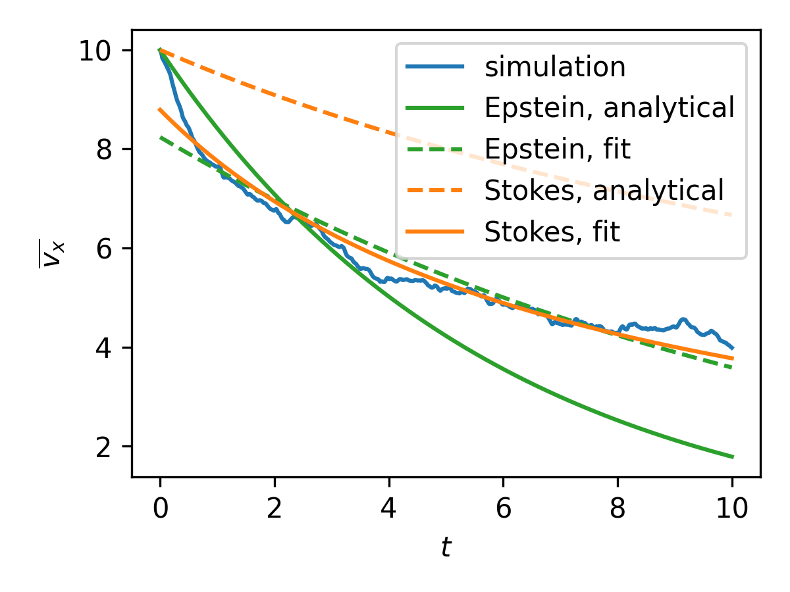
Here we plotted the simulation result in blue, the analytical expectations from Epstein drag in orange (solid line) and a fit from Stokes drag ($$F\propto v^2$$) in orange (dotted line). As we can see, the results do not quite match. First of all: the analytical result does not slow down nearly enough. This might well be due to the fact that we are using periodic boundary conditions, and therefore particles move past the object again and again, so they effectively encounter it multiple times, which adds up. Looking at the fit we also see that the shape of the curve does not quite seem to match the shape of the data.

What could be happening is that the simulation is not tuned correctly to make the fluid behave as a continuous flow, and instead interacts with the object as a simple N-body code. This would mean that the drag experienced by the object is not Stokes drag, but Epstein drag. Epstein drag is the force on a small object that is about the same size as the mean free path of particles in a gas/fluid (so for life-sized objects Stokes drag is applicable, but for tiny dust particles collisions with individual gas/fluid molecules become important, which is described by Epstein drag). Epstein drag force is given by
$$
F=\frac{4}{3}\rho A v_\mathrm{th}v
$$
such that we get
$$
\frac{\mathrm{d}v}{\mathrm{d}t}=-kv, \quad k \equiv \frac{4\rho A v_\mathrm{th}}{3m}
$$
with m the object's mass, rho the fluid density, A the object frontal surface area, and $$v_\mathrm{th}$$ the thermal velocity of particles. We can solve the differential equation by writing
$$
\frac{\mathrm{d}v}{v}=-k\mathrm{d}t
$$
so we get
$$
v=v_0 e^{-kt}
$$
In our simulation, the density rho is equivalent to a surface density sigma divided over an imaginary depth d, while the surface area is A=2Rd, so we get $$\rho A=\frac{\sigma}{D}dD=\sigma D$$. Now since we are not slowing down the object, but the flow itself, the mass of the object is the total mass of the fluid, which we now can call m. Therefore the surface density is $$\sigma=m/L^2$$ with L the size of the simulation. Using all of this we get
$$
k=\frac{8Rv_\mathrm{th}}{3L^2}
$$
In the image above, we plotted the analytical result as well in green (solid line), which is again not slowing down enough, again due to periodic boundary conditions. But the fit does seem to be quite good, as the overall shape looks similar to the simulation result in blue. Also: the MSE of the Stokes fit is $$1.9\times 10^{-2}$$ whereas the MSE of the Epstein fit is a lot smaller: $$5.8\times 10^{-3}$$.

This means that the simulation is creating Epstein drag, meaning that is does not yet corretly simulate a continuous fluid. Possible explanations are that we do not use enough particles, or that we do not include viscosity just yet (as this is important in the Stokes regime). Another thing might be that we are not using the correct smoothing kernel (Gaussian instead of the more accepted splines) and also do not use a large enough smoothing length. These are things that require a bit more research and that we will do next week.


Todo next week:
- [ ] Figure out how to model continuous flow around object (smoothing function, viscosity, number of particles)
- [ ] Implement other equation of state (some simulations of fluids use the ideal gas law with a spline kernel)
- [ ] Look at energy conservation & implement Verlet integration
- [ ] Optimize code (using a finite kernel will allow for great optimization)

Optional:
- [ ] Implement walls & gravity to simulate fluid in a box, an often used example of SPH


## Week 3
(due 3 June 2025, 11:00)
### Tweaked simulation parameters
By tweaking the simulation parameters, the drag already became more like what we expect for a continuous fluid. Using 1000 particles with a smoothing length of 1, thermal velocities of 1, initial flow speed of 10 in a box of 10x10 and a speed of sound of 0.1, an object of radius 1, and max force 1000, the results below were obtained.
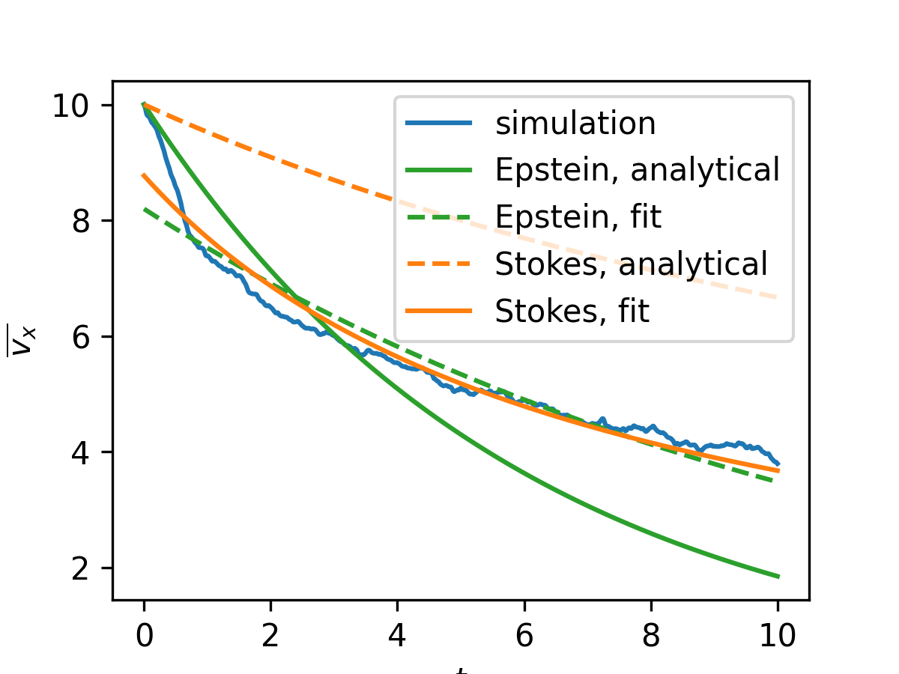
The fit with Stokes drag already seems to be better than the Epstein fit.

After implementing a quintic spline kernel (see below for more), the results changed a bit, but not by much
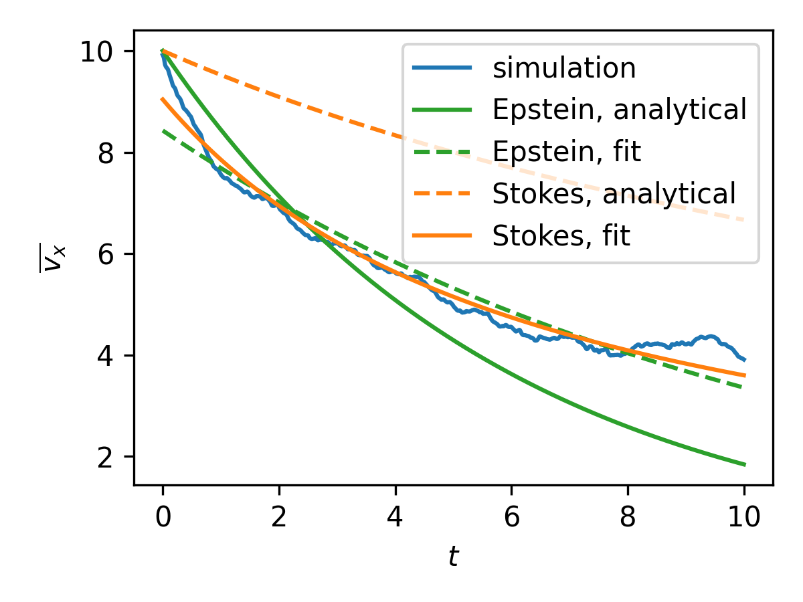

### Spline kernel
We switched from a Gaussian kernel to a quintic spline kernel, as used by Korzani et al. (2017). The equation is given by
$$
W(r,h)=
\begin{cases}
\alpha_\mathrm{d}\left[(3-r/h)^5-6(2-r/h)^5+15(1-q)^5\right], \quad 0\leq r/h < 1,\\
\alpha_\mathrm{d}\left[(3-r/h)^5-6(2-r/h)^5\right], \quad 1\leq r/h < 2,\\
\alpha_\mathrm{d}(3-r/h)^5, \quad 2\leq r/h < 3,\\
0, \quad r/h \geq 3,
\end{cases}
$$
with the normalization constant in 2d
$$
\alpha_\mathrm{d}=\frac{7}{478\pi h^2}.
$$
Note that the normalization constant in Korzani et al. is incorrectly given as $$\frac{7}{47\pi h^2}$$, which does not yield correct normalization, probably due to a typo simply forgetting the 8.

A spline kernel is preferred over a Gaussian for multiple reasons. A Gaussian has infinite extent, which violates locality in the simulation: particles at vast distances still interact with eachother. Apart from that, finite kernels allow for numerical optimization, as one does not have to take into account all particles in the simulation, leading to $$\mathcal{O}(n^2)$$ computation time. Instead computations can be done at $$\mathcal{O}(mn)$$ time, with m the number of particles in reach of a certain particle. We have not implemented such an algorithm in our Python code just yet, but it is already implemented in the C++ code that we plan on switching to later.

This new kernel also satisfies mass conservation better: the infinitely extending kernel extends beyond 2 images of the simulation box (due to periodic bounadry conditions), therefore the integrated density was quite a bit less than the sum of masses. With this new method this difference is a factor of 10 less (the remaining difference probably also due to some numerical integration errors)

### Energy conservation
The energy of the simulation is purely kinetic. We can split it up in the kinetic energy of the bulk motion of the flow and the "thermal" energy from motion of the particles. Furthermore we have a central object that exterts a force
$$
F_\mathrm{object}=\frac{F_\mathrm{max}}{1+\exp{\frac{r-R}{w}}}
$$
with $$F_\mathrm{max}$$ the maximum force of the object, r the distance of a particle to the center of the object, R the radius of the object, and w the width/smoothness of the object's boundary. This causes a potential on the particles that is found from integrating this force
$$
E_\mathrm{object}=wF_\mathrm{max}\ln{\left(e^\frac{R-r}{w}+1\right)}.
$$
The total energy is just the sum of the kinetic energy and the potential energy from this object. The bulk motion is just the average velocity of all particles squared times the total mass. The flow energy is found from subtracting the mean velocity of all particles from the velocity of each particle, and then summing the square of that:
$$
E_\mathrm{th}=\frac{1}{2}\sum_{i}m_i(\mathbf{v}_i-\overline{\mathbf{v}})^2
$$
with
$$
E_\mathrm{flow}=\frac{1}{2}\overline{\mathbf{v}}^2\sum_i m_i
$$
The result is shown below
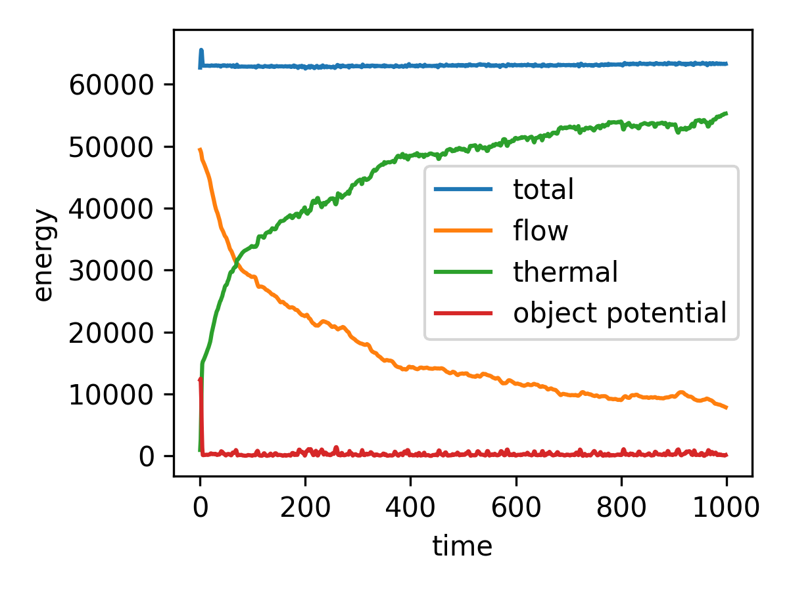
We can see that the potential energy decreases at first, because some particles are initialized inside of the object and move out during the first iterations. The total energy has a kind of bump there, maybe because there is a one-iteration offset between the potential and the kinetic, but it recovers the initial value. After the particles have moved out of the object, total energy is approximately conserved, and flow enenergy is traded for thermal energy as the object slows down the flow through drag.

We can see just the total energy below
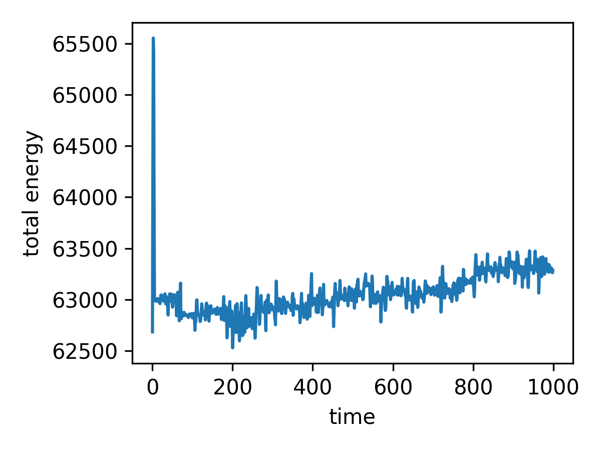
We can see that it slowly increases: from $62866.6 \pm 6.0$ between timestamp 100 and 200 to $63305.2 \pm 7.3$ in the final 100 iterations. This probably because we still use a simple Euler forward integration scheme

### Modified ideal gas law
We have been using the cole equation of state up to now, which is given by

$$
P=B\left(\left(\frac{\rho}{\rho_0}\right)^\gamma-1\right)
$$
with $$B=c_\mathrm{s}^2\rho_0/\gamma$$. This equation of state is often used to model poorly compressible fluids. However it can lead to numerical instability when the density is lower than the reference density rho_0: the pressure becomes negative, particles start attracting eachother, leading to clumping and instabilities. This can be seen blow.
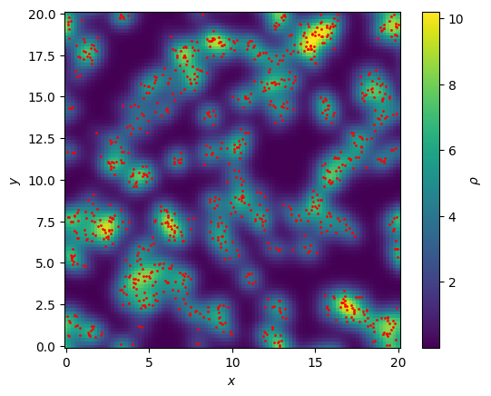
We initialized particles uniformly, but with an average density much lower than rho_0 and it lead to this clustering.

In literature modified versions of the ideal gas law are often used. In Korzani et al. they use
$$
P=P_0+c_\mathrm{s}^2\left(\rho-\rho_0\right)
$$
with $$c_\mathrm{s}$$ the speed of sound, rho the density and P_0 and rho_0 a reference pressure and density respectively. These references are added for numerical stability, for example to avoid negative pressures which again lead to clustering. In Korzani the reference pressure is defined as
$$
P_0=\beta c_\mathrm{s}^2\rho_0
$$
where beta is a coefficient that is tweaked to get stable results, they use 0.07. The reference density is simply set to the average density in the simulation.

The same simulation as above was run, but now with this modified ideal gas law, and the result can be seen below.
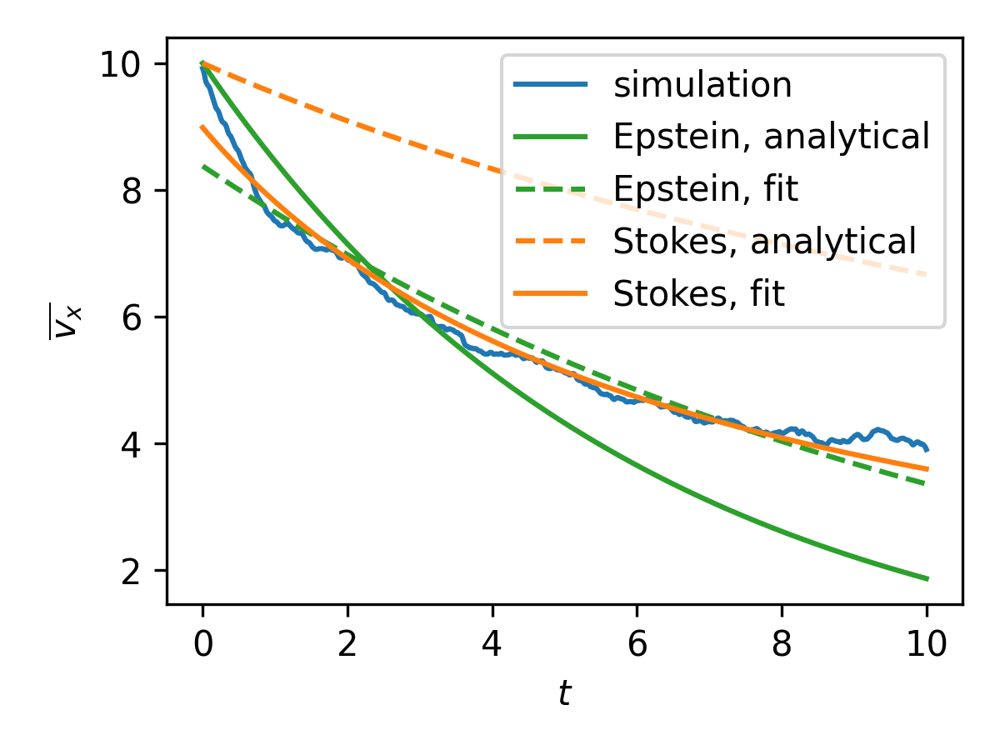
We can again see that the results are very close, so this new equation of state seems to work as expected.

### Mistake in integration
We found a mistake in the integration loop:
```
velocities[i] = velocities[i-1] + dt*(pressure_forces(positions[i], masses, L, h, c_s, rho0)+central_object_forces(positions[i], L, central_object))/masses[:,None]
```
This was meant to be an Euler-forward loop, but it became a mix between the explicit forward euler and the implicit backward euler method. Somehow it was actually incredibly stable, because in the plots above you can see that the total energy is very well conserved, although not precisely. After fixing the mistake, and making it proper euler-forward:
```
velocities[i+1] = velocities[i] + dt*(get_pressure_forces(positions[i], masses, L, h, c_s, rho0)+central_object_forces(positions[i], L, central_object))/masses[:,None]
```
The results change, and energy is much less conserved, as can be seen below
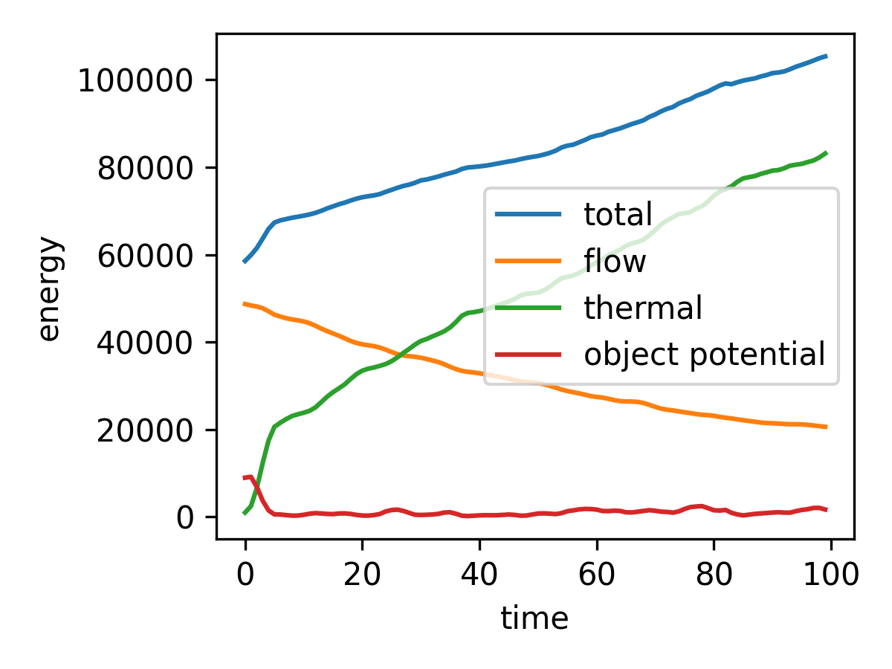
Since the proper euler forward works very badly, and we cannot really justify the method with the mistake we were using earlier, we will switch to Leapfrog integration, which we were planning on anyways, since it is symplectic.

After implementing the Leapfrog scheme, we ran a simulation that took 10x as long, and our result can be seen below
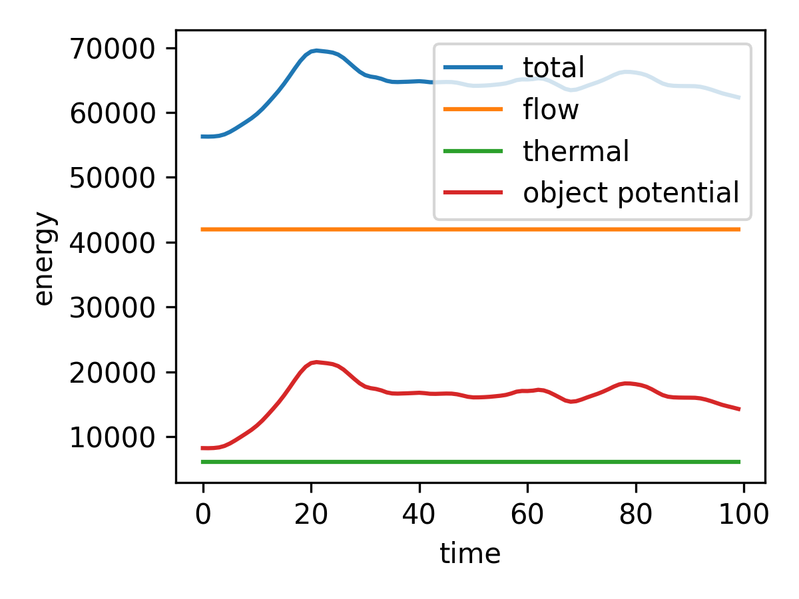
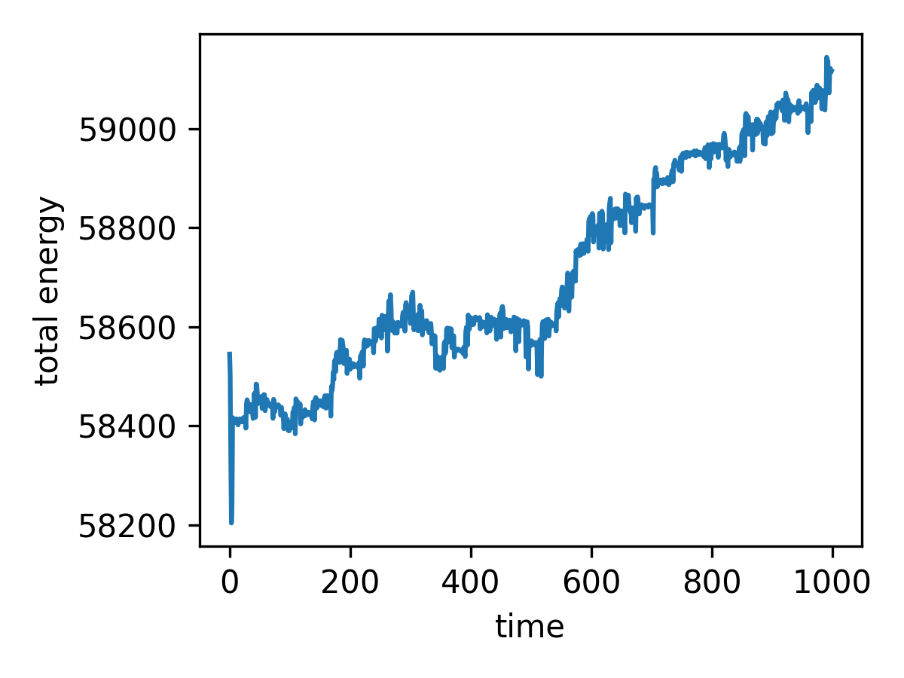
We can see that the total energy is not exactly conserved, which we are not yet sure of why this is, so we'll be looking into this

### cd vs. time
In the paper we are trying to recreate, they show the drag coefficient as a function of the simulation time. They show that it is very high at the start, but quickly converges to a constant value. We did the same and the result is show below
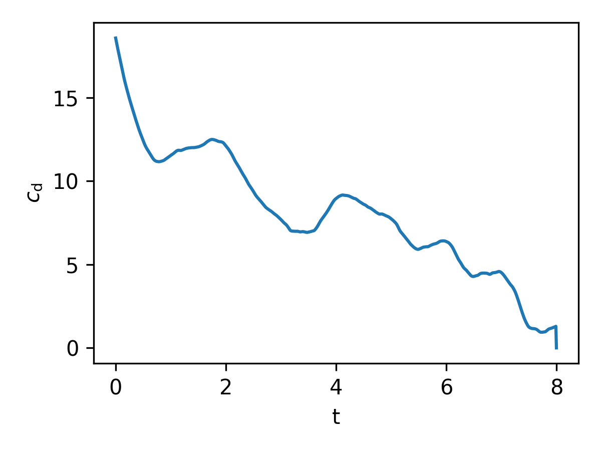
We also see a decrease in the drag coefficient, but not as sharply and it does not quite seem to converge. For us it might also decrease because the entire flow slows down (periodic boundary conditions). Also we do not yet have viscosity which is an important effect for drag.

### C++ implementation
The SPH simulation, including the optimized algorithm for faster calculation, was implemented in C++, so we are switching from our python code to the C++ code.

To check results, we ran two similiar simulations of fluid flow around a central object. The animations from the python and C++ simulations can be found in figures/py_animation.mp4 and figures/cpp_animation.mp4 respectively. We can see that the fluid behaves very similar. Some differences are still there, mainly because the C++ implementation uses another kernel and equation of state. Also the input parameters are initialized differently in C++, so all parameters are only approximately the same.

## Week 4
This week we completely switched over to c++ because python was too slow.

### In and outflow
We want to have a steady inflow instead of a periodic condition in the x direction. We do this by assigning inflow to particles below a certain x value.
We than skip the inflow particles in the force calculations, so that they only apply a force on the mainflow particles, but not the other way around. When an inflow particle crosses the inflow x threshold, it is converted to a mainflow particle, and a new inflow particle is spawned at x=0, and at the same y as the particle that just left. This causes a steady inflow, and is also the method applied in the paper that we try to reproduce.

Outflow particles are also assigned above a certain x threshold. Just like inflow particles, outflow particles produce a force on mainflow particles, but not the other way around. When an outflow particle crosses the boundaries of the simulation in the x direction, it is deleted from the array. Note that this means that we do not necessarily have a constant amount of particles! This could mean that we get fluctuations in the number of particles, which is undesirable. To remedy this, we need to carefully choose our value for the speed of sound in the fluid. The paper suggests a speed of sound 5 to 20 times that of the inflow velocity, which is what we did as well, tweaking along the way when we saw significant fluctuations in the number of particles. The figure below shows the inflow particles in blue, and the outflow particles in green. We also see ghost particles in black, which we will get to later.
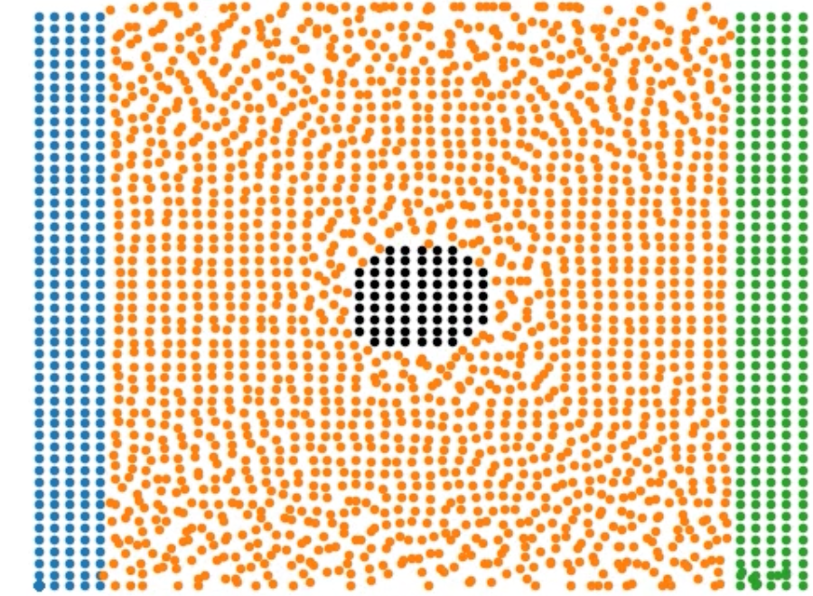

### Viscosity
The last term missing in the navier stokes equation is the viscosity term. In sph simulations, an artificial viscosity terms is added. The term that we used was the one by Morris, 
$$
\Sigma_b \frac{m_b(\mu_a + \mu_b)v_{ab}}{\rho_a \rho_b} (\frac{1}{r_{ab}}\frac{\partial W}{\partial r_{a}})
$$

where  v_{ab} denotes the relative velocity.

### Ghost particles
The last kind of particles that we have are called ghost particles, they are what comprises that central cylinder in the simulation. At initialization we take a disk of particles in the middle of the field and call them ghost particles. These particles do not move, but are otherwise evolved through the same equations as the rest of the particles. 
In fluid dynamics, an important feature of solid walls is the no-slip condition, which states that the velocity of fluid at the wall is zero.
To ensure the no-slip condition in our simulation, we made use of artificial velocities for the ghost particles. See the below figure.
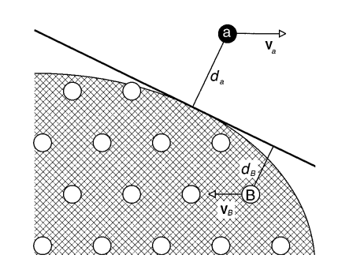
What we do, is we take the velocity of a nearby particle, and extrapolate it over the tangent line touching the circle. Then, the normal distance of a ghost particle to this line is calculated. To ensure that velocities are zero at the boundary, we then take 
$$v_{ab} = \beta v_a$$
 to calculate the artificial velocity of the ghost particles. The beta here serves as a kind of regulation parameter, where we take 
 $$\beta = min(\beta_{max}, 1+ \frac{d_B}{d_a})$$ 
 We use 
 $$\beta_{max} = 1.5$$
 like the paper.

### Drag coefficient
The drag coefficient can be calculated as such: Everytime we see that a mainflow particle subjects a force into a ghost particle, we mirror the force and add it to the drag force on the cylinder. Now that we have the drag force of the particle, the drag coefficient $C_d$ can be calculated as 
$$\frac{2*F_{drag}}{v_0^2*\rho_0*D}$$
 with v_0 the inflow velocity,rho_0 the reference density, and D the cylinder diameter.
When we do this for different reynolds numbers 
$$Re = \rho_0 v_0 D/\nu$$
 we get the final desired result for this project, which is the relation between the reynolds number and the drag coefficient. The results can be seen in the figure below:
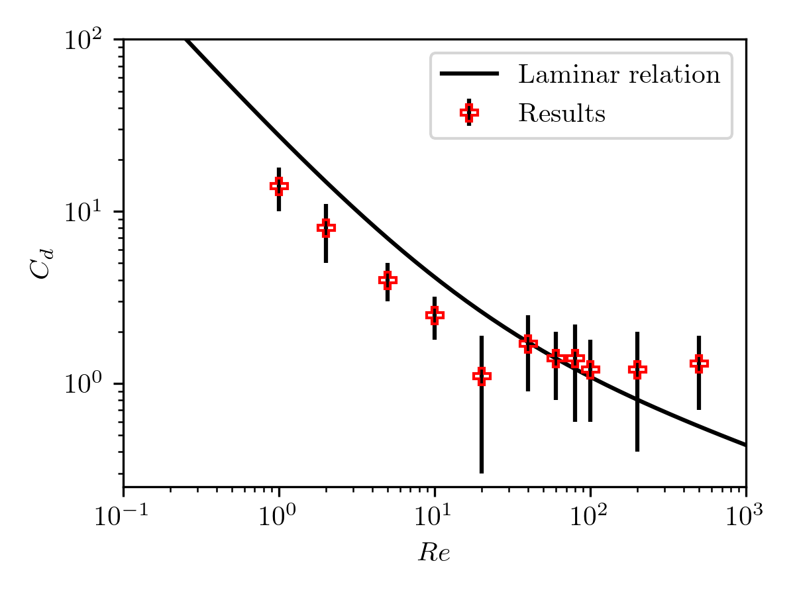
Where we have added the emperical schiller naumann relation 
$$C_d = \frac{24}{Re}(1+0.15Re^{0.687})$$
 as reference.


## Reminder final deadline

The deadline for project 3 is **9 June 23:59**. By then, you must have uploaded the presentation slides to the repository, and the repository must contain the latest version of the code.
